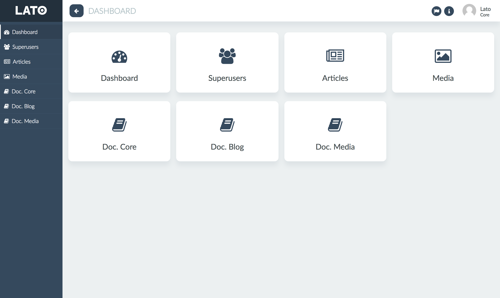

# Lato Core

Lato is a Rails engine used to develop modular admin panels. This is the module used to initialize the admin panel.
The complete documentation is inside the application panel, so you must [install](#installation) it before.

You can always try a demo here: https://lato-server.herokuapp.com



## Ecosystem

- [Lato core](https://github.com/ideonetwork/lato-core): The core module used to initialize the panel.
- [Lato media](https://github.com/ideonetwork/lato-media): A module used to manage attachments and media files.
- [Lato blog](https://github.com/ideonetwork/lato-blog): A module used to manage a blog.

## Installation

Add the lato_core gem on your Gemfile

```ruby
gem 'lato_core'
```

Install the gem

```console
bundle install
```

Copy the migrations

```console
rails lato_core:install:migrations
```

Exec migrations

```console
bundle exec rake db:migrate
```

Now you can start the server and go to the relative url */lato/core*
